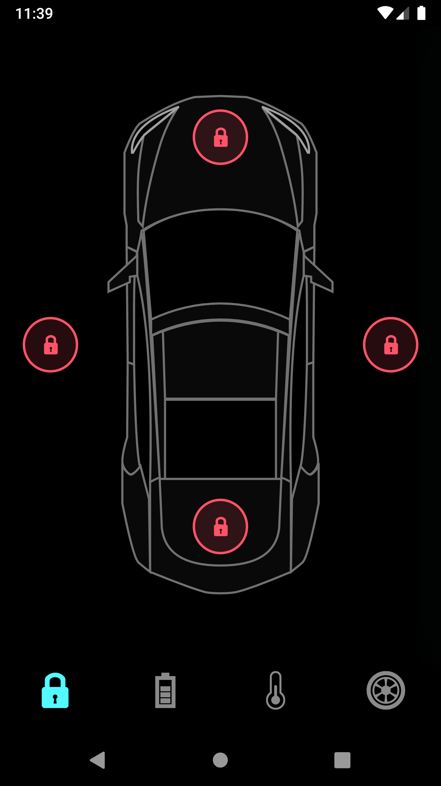
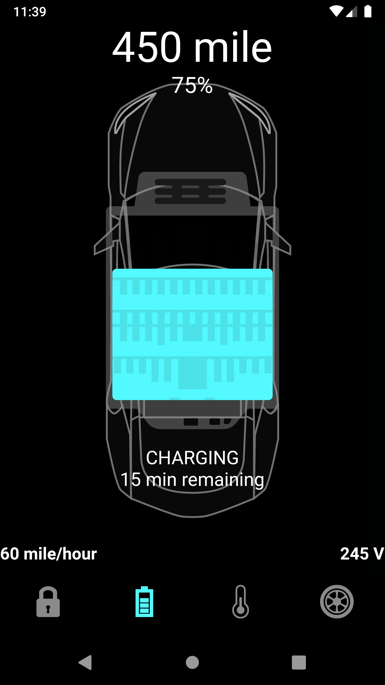
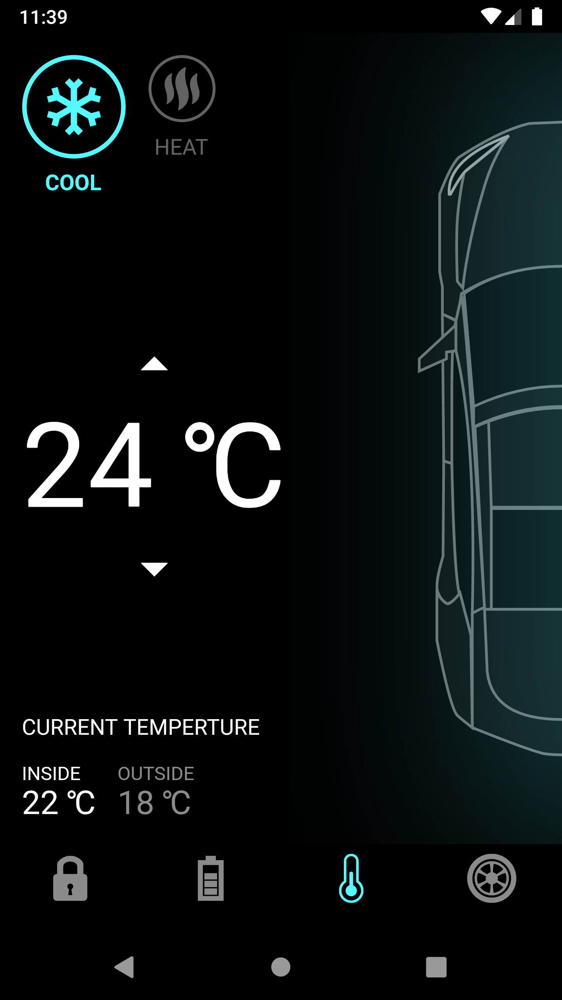
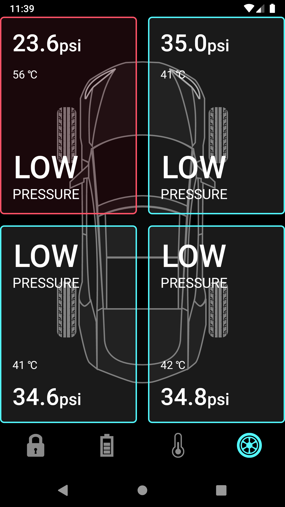

# animated_tesla_car_control_app

---ScreenShots & Videos---

  |    |
  |    |

https://user-images.githubusercontent.com/102043234/170867517-75df4285-b60a-425f-b3a8-13ecf65727c6.mp4

Inspired on: https://www.youtube.com/c/TheFlutterWay

The Playlist: https://www.youtube.com/playlist?list=PLxUBb2A_UUy8iZsirTiFng5O8rsbOaVqO

## Getting Started

This project is a starting point for a Flutter application.

A few resources to get you started if this is your first Flutter project:

- [Lab: Write your first Flutter app](https://flutter.dev/docs/get-started/codelab)
- [Cookbook: Useful Flutter samples](https://flutter.dev/docs/cookbook)

For help getting started with Flutter, view our
[online documentation](https://flutter.dev/docs), which offers tutorials,
samples, guidance on mobile development, and a full API reference.
